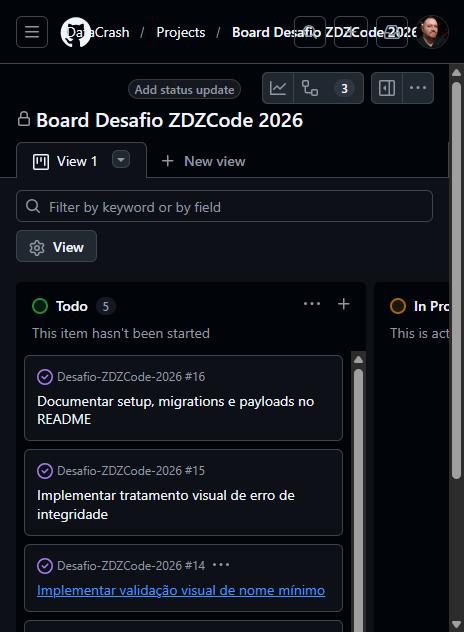
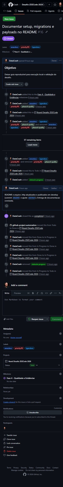
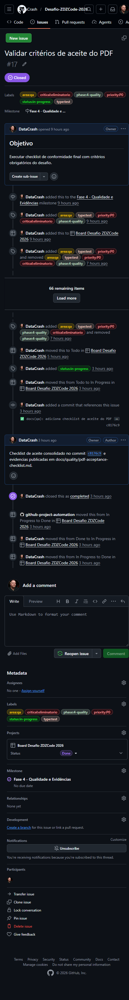
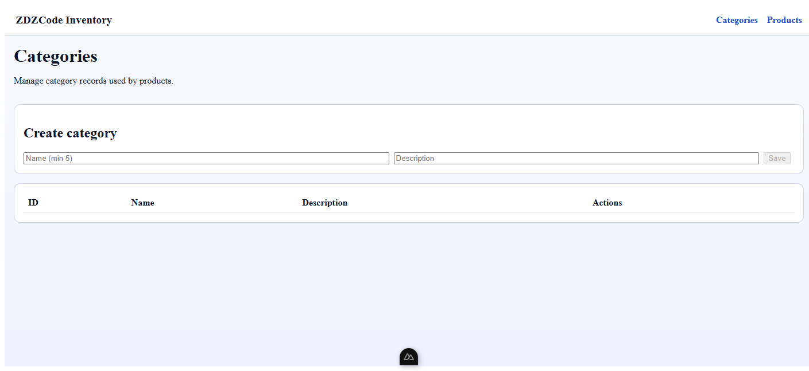
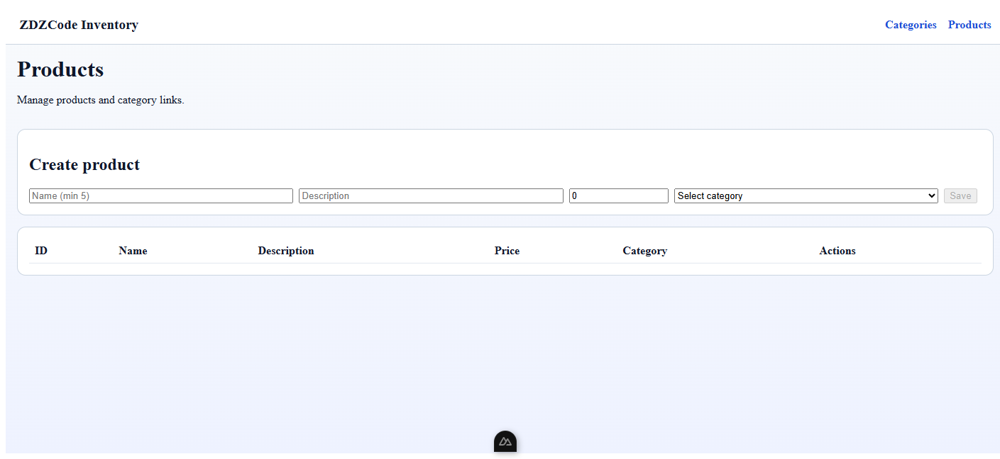
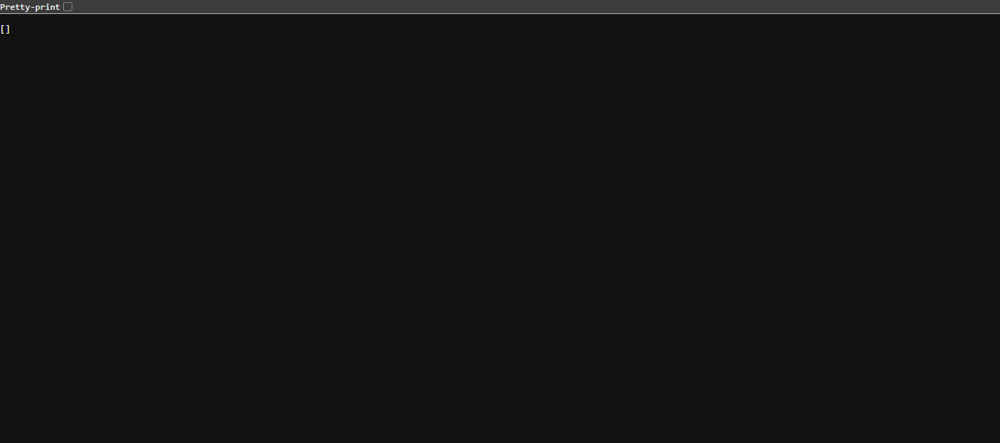

# Overview do Desafio ZDZCode 2026

## 1) Objetivo deste relatório

Consolidar, em um único documento, as evidências de entrega do desafio técnico, incluindo:

- status do backlog/board,
- evidências visuais dos cards,
- evidências do sistema em execução,
- links para artefatos de documentação e submissão.

## 2) Escopo implementado

- Backend: ASP.NET Core + EF Core + SQLite.
- Frontend: Nuxt + Vue.
- Funcionalidades principais:
  - CRUD de categorias;
  - CRUD de produtos;
  - validações de domínio (nome mínimo, integridade referencial);
  - UI reativa sem refresh forçado.

## 3) Status final do trabalho

- Repositório sincronizado em `develop`.
- Issues: Open (0) e Closed (17).
- Board sem trabalho ativo em andamento.

## 4) Evidências do board e cards

### 4.1 Board

### 4.2 Cards detalhados

## 5) Evidências do sistema funcionando

### 5.1 Frontend - tela de categorias

### 5.2 Frontend - tela de produtos

### 5.3 API - endpoint de categorias

## 6) Artefatos de suporte

- Checklist de aceite: `docs/quality/pdf-acceptance-checklist.md`
- Resumo executivo: `docs/quality/final-executive-summary.md`
- Pacote de submissão: `docs/delivery/submission-package.md`
- Mensagens de submissão (PT-BR): `docs/delivery/submission-message-variants.md`
- Mensagens de submissão (EN): `docs/delivery/submission-message-variants.en.md`
- Arquivo de submissão na raiz: `Submissão.md`

## 7) Conclusão

A entrega foi concluída com backlog encerrado, documentação consolidada e evidências visuais do board e da execução do sistema registradas na pasta `Overview-Desafio`.
