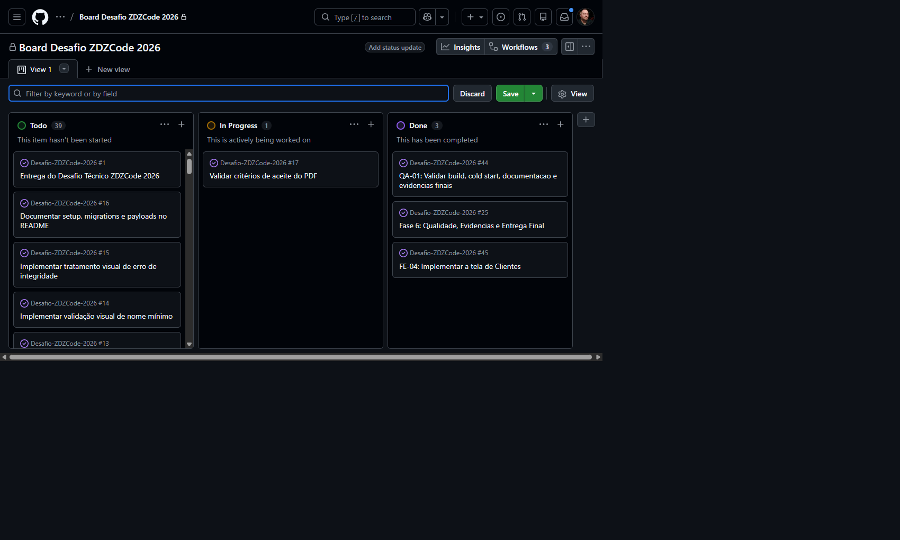
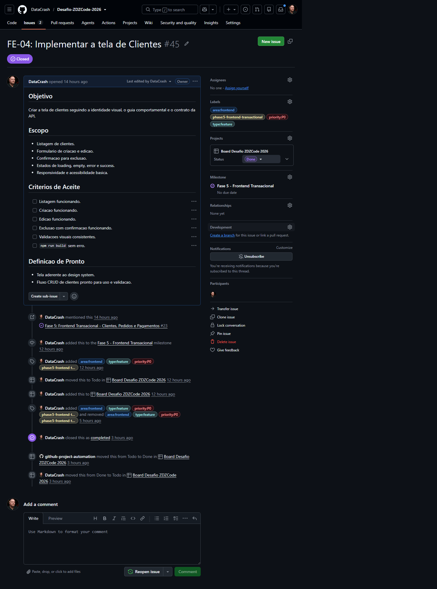
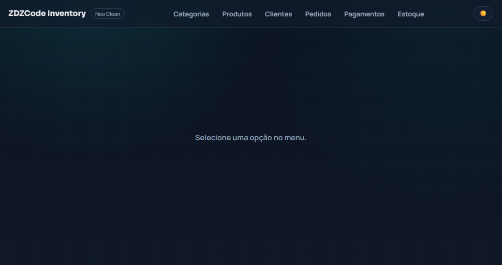
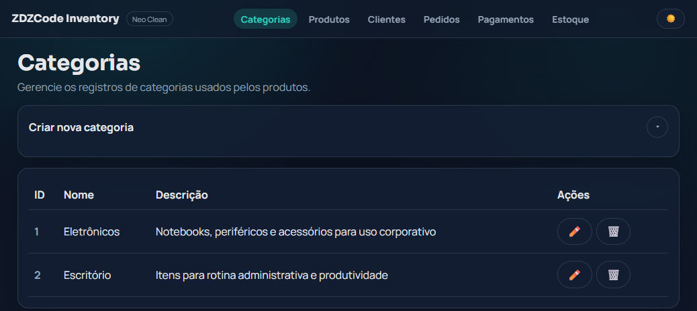
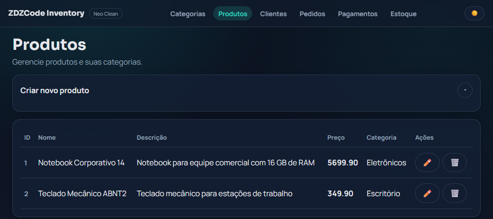
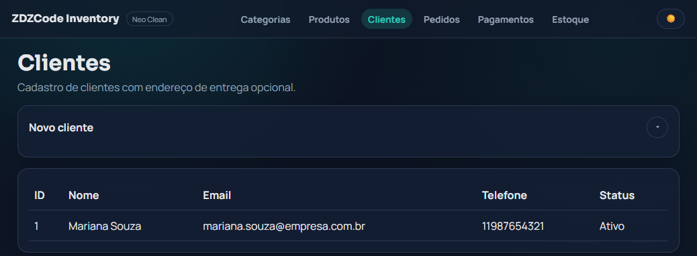
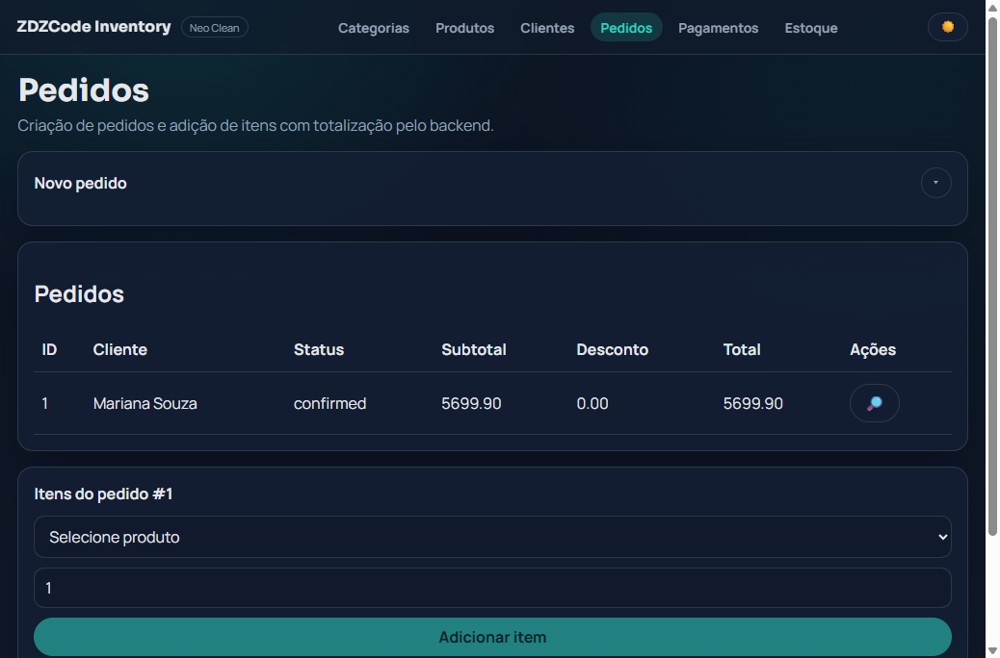
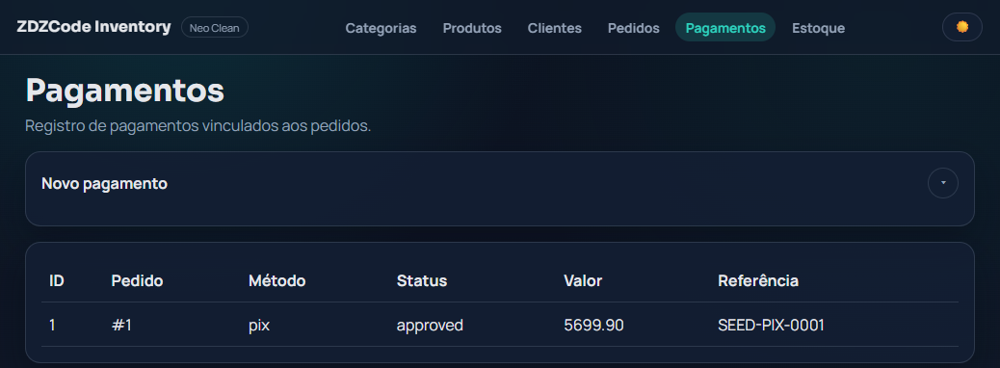
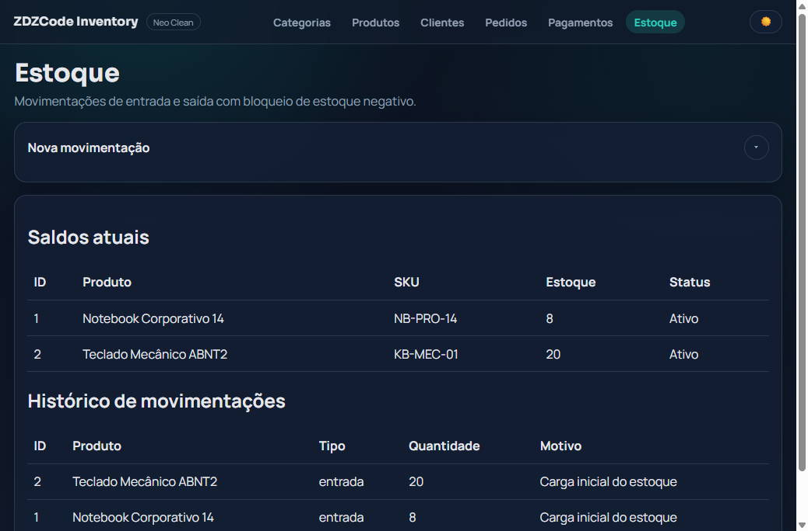

# Relatório Final de Entrega

## 1. Resumo da entrega

Este relatório consolida o estado final da entrega do desafio ZDZCode 2026, incluindo:

1. Escopo funcional implementado no backend e frontend.
1. Evidências visuais atualizadas de todas as telas do sistema.
1. Evidência operacional do board de trabalho.
1. Referências diretas para validação técnica e de negócio.

## 2. Escopo entregue

1. Backend com API REST em ASP.NET Core, EF Core e SQLite.
1. Frontend em Nuxt 4 + Vue 3 com navegação por módulos.
1. Módulos disponíveis na interface:
   - Home
   - Categorias
   - Produtos
   - Clientes
   - Pedidos
   - Pagamentos
   - Estoque
1. Seed inicial com dados verossímeis para validação manual.
1. Regras de domínio e validações aplicadas em backend/frontend.

## 3. Evidências visuais (prints atualizados)

### 3.1 Board de execução

### 3.2 Último card de conclusão do desafio

### 3.3 Tela inicial (home)

### 3.4 Tela de categorias

### 3.5 Tela de produtos

### 3.6 Tela de clientes

### 3.7 Tela de pedidos

### 3.8 Tela de pagamentos

### 3.9 Tela de estoque

## 4. Referências para auditoria rápida

1. README principal: [README.md](../../README.md)
1. Fechamento de uma página: [final-delivery-one-page.md](final-delivery-one-page.md)
1. Checklist de aceite: [pdf-acceptance-checklist.md](../quality/pdf-acceptance-checklist.md)
1. Resumo executivo detalhado: [final-executive-summary.md](../quality/final-executive-summary.md)
1. Requests HTTP da API: [ZDZCode.Api.http](../../src/backend/ZDZCode.Api/ZDZCode.Api.http)

## 5. Status final

1. Entrega técnica consolidada.
1. Documentação e evidências visuais atualizadas.
1. Material pronto para revisão final e submissão.
